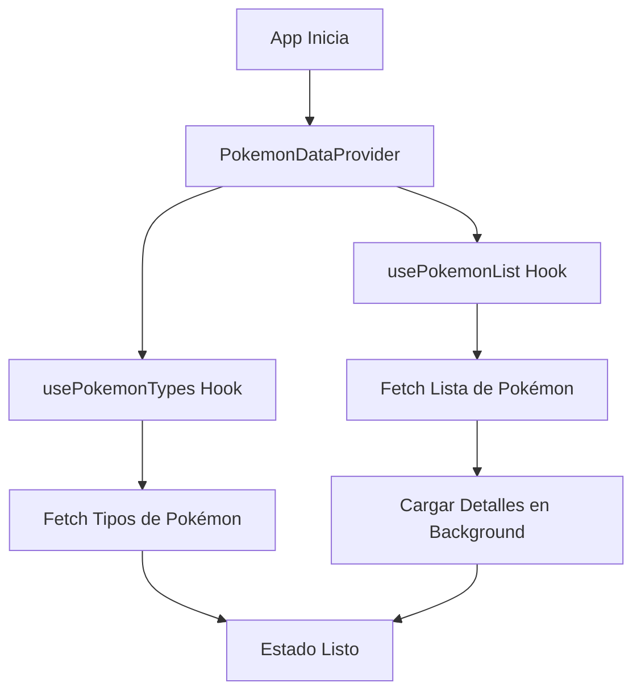
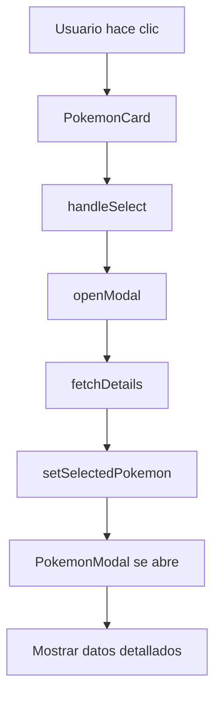
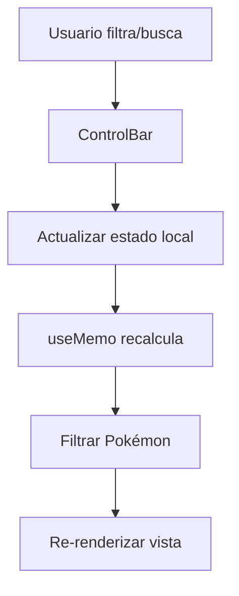

# Arquitectura del Proyecto Pokémon Explorer 🏗️

## Visión General

Pokémon Explorer es una aplicación web moderna construida con Next.js 15 y React 19, diseñada para explorar y descubrir información detallada sobre Pokémon. La aplicación utiliza una arquitectura basada en componentes con gestión de estado centralizada.

## Diagrama de Arquitectura

```
┌─────────────────────────────────────────────────────────────┐
│                    Next.js App Router                       │
├─────────────────────────────────────────────────────────────┤
│  app/                                                       │
│  ├── layout.tsx (Layout principal)                         │
│  ├── page.tsx (Página principal)                           │
│  └── globals.css (Estilos globales)                        │
├─────────────────────────────────────────────────────────────┤
│                    Context Layer                            │
│  context/PokemonDataContext.tsx (Estado global)            │
├─────────────────────────────────────────────────────────────┤
│                    Hooks Layer                              │
│  hooks/                                                     │
│  ├── usePokemonList.ts (Lista de Pokémon)                  │
│  ├── usePokemonDetails.ts (Detalles individuales)          │
│  ├── usePokemonDetailsCache.ts (Caché de detalles)         │
│  └── usePokemonTypes.ts (Tipos de Pokémon)                 │
├─────────────────────────────────────────────────────────────┤
│                   Components Layer                          │
│  components/                                                │
│  ├── Views/ (Vistas principales)                           │
│  ├── Layout/ (Componentes de layout)                       │
│  ├── ui/ (Componentes de UI reutilizables)                 │
│  └── [otros componentes]                                   │
├─────────────────────────────────────────────────────────────┤
│                    Utils Layer                              │
│  utils/                                                     │
│  ├── pokemonColors.ts (Colores de tipos)                   │
│  ├── statColors.ts (Colores de estadísticas)               │
│  └── typeEffectiveness.ts (Efectividad de tipos)           │
├─────────────────────────────────────────────────────────────┤
│                    Types Layer                              │
│  types/pokemon.ts (Definiciones de TypeScript)             │
├─────────────────────────────────────────────────────────────┤
│                    External APIs                            │
│  PokéAPI (https://pokeapi.co/)                             │
└─────────────────────────────────────────────────────────────┘
```

## Capas de la Aplicación

### 1. Capa de Presentación (UI Layer)

**Responsabilidades:**
- Renderizado de componentes
- Interacción con el usuario
- Responsive design
- Accesibilidad

**Componentes principales:**
- `HomePage`: Componente principal que orquesta toda la aplicación
- `PokemonGrid`: Vista de cuadrícula con paginación
- `PokemonTable`: Vista de tabla con TanStack Table
- `PokemonModal`: Modal de detalles completos
- `PokemonCard`: Tarjeta individual de Pokémon

### 2. Capa de Estado (State Layer)

**Responsabilidades:**
- Gestión de estado global
- Caché de datos
- Sincronización entre componentes
- Manejo de estados de carga y error

**Componentes principales:**
- `PokemonDataContext`: Context principal con estado global
- Hooks personalizados para diferentes tipos de datos

### 3. Capa de Datos (Data Layer)

**Responsabilidades:**
- Fetching de datos desde APIs externas
- Caché inteligente
- Manejo de errores de red
- Optimización de requests

**Componentes principales:**
- Hooks de datos (`usePokemonList`, `usePokemonDetails`, etc.)
- Utilidades de transformación de datos

### 4. Capa de Utilidades (Utils Layer)

**Responsabilidades:**
- Funciones helper reutilizables
- Lógica de negocio
- Transformaciones de datos
- Constantes y configuraciones

## Flujo de Datos

### 1. Inicialización de la Aplicación



### 2. Interacción del Usuario



### 3. Filtrado y Búsqueda



## Patrones de Diseño Utilizados

### 1. Context Pattern
- **Propósito**: Compartir estado entre componentes sin prop drilling
- **Implementación**: `PokemonDataContext`
- **Beneficios**: Estado centralizado, fácil testing, reutilización

### 2. Custom Hooks Pattern
- **Propósito**: Encapsular lógica reutilizable
- **Implementación**: Hooks en `src/hooks/`
- **Beneficios**: Separación de responsabilidades, reutilización, testing

### 3. Compound Components Pattern
- **Propósito**: Componentes que trabajan juntos
- **Implementación**: `Modal` y sus subcomponentes
- **Beneficios**: Flexibilidad, composición

### 4. Render Props Pattern
- **Propósito**: Compartir lógica entre componentes
- **Implementación**: Funciones de callback en props
- **Beneficios**: Reutilización de lógica, flexibilidad

## Gestión de Estado

### Estado Global (Context)
```typescript
interface PokemonDataContextProps {
  // Datos principales
  pokemons: PokemonListItem[];
  pokemonTypes: PokemonTypeOption[];
  
  // Estados de carga
  loading: boolean;
  typesLoading: boolean;
  
  // Estados de error
  error: string | null;
  typesError: string | null;
  
  // Funciones de datos
  fetchDetails: (namesOrUrls: string[]) => Promise<void>;
  getDetails: (nameOrUrl: string) => PokemonDetails | null;
  isLoadingDetails: (nameOrUrl: string) => boolean;
  
  // Estado del modal
  selectedPokemon: string | null;
  openModal: (pokemonName: string) => void;
  closeModal: () => void;
}
```

### Estado Local (Componentes)
- Filtros de búsqueda
- Modo de vista (grid/table)
- Ordenamiento
- Paginación

## Optimizaciones de Rendimiento

### 1. Memoización
- `useMemo` para cálculos costosos (filtrado, ordenamiento)
- `React.memo` para componentes que no cambian frecuentemente
- `useCallback` para funciones que se pasan como props

### 2. Caché Inteligente
- Caché en memoria para detalles de Pokémon
- Evita requests duplicados
- Carga en background de datos necesarios

### 3. Lazy Loading
- Imágenes con `loading="lazy"`
- Componentes cargados bajo demanda
- Paginación para listas grandes

### 4. Optimizaciones de React
- Keys únicas en listas
- Fragmentos para evitar divs innecesarios
- Condicional rendering optimizado

## Manejo de Errores

### 1. Niveles de Error
- **Error de red**: Fallback a mensaje de error
- **Error de datos**: Estados de carga y error en componentes
- **Error de usuario**: Validaciones y feedback visual

### 2. Estrategias de Recuperación
- Reintentos automáticos para requests fallidos
- Estados de fallback para datos faltantes
- Mensajes de error informativos

## Testing Strategy

### 1. Tipos de Tests
- **Unit Tests**: Hooks, utilidades, componentes individuales
- **Integration Tests**: Flujos de usuario completos
- **E2E Tests**: Casos de uso críticos

### 2. Herramientas Recomendadas
- Jest para testing unitario
- React Testing Library para testing de componentes
- MSW para mocking de APIs
- Playwright para testing E2E

## Escalabilidad

### 1. Estructura Modular
- Componentes reutilizables
- Separación clara de responsabilidades
- Fácil agregar nuevas funcionalidades

### 2. Performance
- Código splitting automático con Next.js
- Optimizaciones de bundle
- Caché eficiente

### 3. Mantenibilidad
- TypeScript para type safety
- Documentación completa
- Patrones consistentes

## Consideraciones de Seguridad

### 1. Sanitización de Datos
- Validación de inputs del usuario
- Escape de contenido dinámico
- Sanitización de URLs de imágenes

### 2. APIs Externas
- Rate limiting respetado
- Manejo de errores de API
- Timeouts apropiados

## Deployment y CI/CD

### 1. Build Process
- Optimización automática de imágenes
- Minificación de código
- Tree shaking para reducir bundle size

### 2. Environment Variables
- Configuración por ambiente
- Variables sensibles protegidas
- Configuración de APIs

## Métricas y Monitoreo

### 1. Performance Metrics
- Core Web Vitals
- Time to Interactive
- Bundle size analysis

### 2. User Analytics
- Eventos de interacción
- Métricas de uso
- Error tracking

## Futuras Mejoras

### 1. Funcionalidades Planificadas
- Búsqueda avanzada
- Filtros adicionales
- Comparación de Pokémon
- Favoritos y listas personalizadas

### 2. Optimizaciones Técnicas
- Service Workers para offline
- PWA capabilities
- SSR mejorado
- Micro-frontends

### 3. Arquitectura
- Migración a microservicios
- GraphQL para APIs
- Real-time updates
- Internacionalización completa 