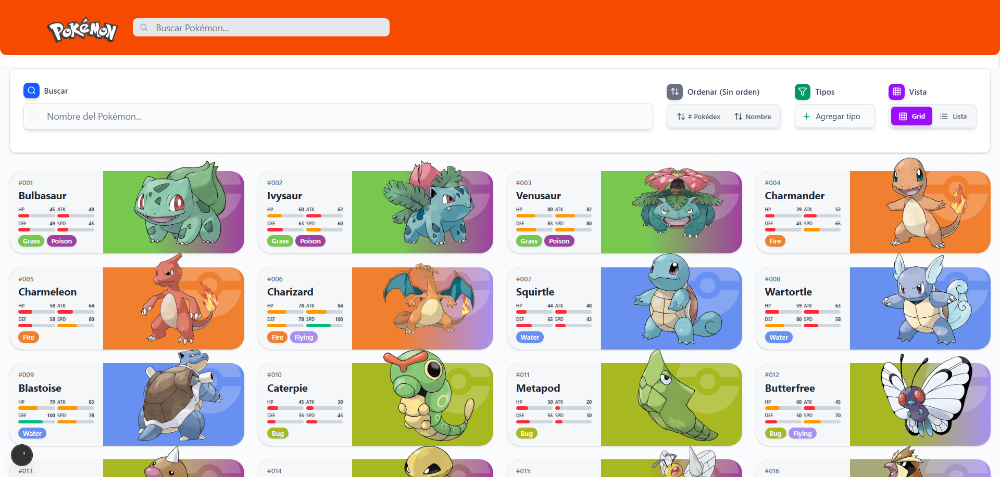

# PokeApi Kanto 🎮

Una aplicación web moderna para explorar y descubrir el mundo Pokémon, construida con Next.js 15, React 19, TypeScript y Tailwind CSS.

## 🖼️ Captura de Pantalla



## 🌐 Demo en Vivo

**[Ver Demo en Vercel](https://pokeapi-frontend-chi.vercel.app/)**

## 📋 Tabla de Contenidos

- [Captura de Pantalla](#-captura-de-pantalla)
- [Demo en Vivo](#-demo-en-vivo)
- [Características](#características)
- [Tecnologías](#tecnologías)
- [Instalación](#instalación)
- [Estructura del Proyecto](#estructura-del-proyecto)
- [Componentes](#componentes)
- [Hooks](#hooks)
- [Context y Estado](#context-y-estado)
- [Utilidades](#utilidades)
- [API](#api)
- [Scripts Disponibles](#scripts-disponibles)

## ✨ Características

- **Exploración Completa**: Visualiza los primeros 151 Pokémon con información detallada
- **Vistas Múltiples**: Alterna entre vista de cuadrícula y tabla
- **Filtrado Avanzado**: Filtra por tipo de Pokémon
- **Búsqueda en Tiempo Real**: Busca Pokémon por nombre
- **Ordenamiento**: Ordena por nombre o # en la pokedex
- **Modal Detallado**: Información de cada Pokémon
- **Diseño Responsivo**: Optimizado para todos los dispositivos
- **Caché Inteligente**: Carga eficiente de datos con caché automático
- **Animaciones**: Transiciones suaves y efectos visuales
- **Tipos de Pokémon**: Colores y efectividad de tipos
- **Estadísticas Visuales**: Barras de progreso para stats

## 🛠 Tecnologías

- **Framework**: Next.js 15 (App Router)
- **UI Library**: React 19
- **Lenguaje**: TypeScript
- **Styling**: Tailwind CSS 4
- **HTTP Client**: Axios
- **Tablas**: TanStack React Table
- **Iconos**: Lucide React
- **Fuentes**: Geist (Google Fonts)

## 🚀 Instalación

1. **Clona el repositorio**:
```bash
git clone https://github.com/ingdanielen/pokeapi-frontend.git
cd pokeapi-frontend
```

2. **Instala las dependencias**:
```bash
npm install
# o
yarn install
# o
pnpm install
```

3. **Ejecuta el servidor de desarrollo**:
```bash
npm run dev
# o
yarn dev
# o
pnpm dev
```

4. **Abre tu navegador**:
Navega a [http://localhost:3000](http://localhost:3000)

## 📁 Estructura del Proyecto

```
pokeapi-frontend/
├── src/
│   ├── app/                    # Next.js App Router
│   │   ├── layout.tsx         # Layout principal
│   │   ├── page.tsx           # Página principal
│   │   └── globals.css        # Estilos globales
│   ├── components/            # Componentes React
│   │   ├── Layout/           # Componentes de layout
│   │   ├── Views/            # Vistas principales
│   │   ├── ui/               # Componentes de UI reutilizables
│   │   └── [otros componentes]
│   ├── context/              # Context de React
│   ├── hooks/                # Custom hooks
│   ├── types/                # Definiciones de TypeScript
│   └── utils/                # Funciones utilitarias
├── public/                   # Archivos estáticos
└── [archivos de configuración]
```

## 🧩 Componentes

### Componentes Principales

#### `HomePage` (`src/components/Views/HomePage.tsx`)
Componente principal que orquesta toda la aplicación.

**Funcionalidades**:
- Gestión del estado de filtros y búsqueda
- Lógica de ordenamiento
- Renderizado condicional de vistas (grid/table)
- Integración con el modal de detalles

**Props**: Ninguna (usa context interno)

#### `PokemonGrid` (`src/components/PokemonGrid.tsx`)
Renderiza los Pokémon en formato de cuadrícula con paginación.

**Props**:
- `pokemons`: Lista de Pokémon a mostrar
- `getDetails`: Función para abrir modal de detalles
- `getIdFromUrl`: Función para extraer ID de URL
- `getImageUrl`: Función para obtener URL de imagen

#### `PokemonTable` (`src/components/PokemonTable.tsx`)
Renderiza los Pokémon en formato de tabla usando TanStack Table.

**Props**:
- `pokemons`: Lista de Pokémon a mostrar
- `getDetails`: Función para abrir modal de detalles
- `getDetailsData`: Función para obtener datos del Pokémon
- `isLoadingDetails`: Función para verificar estado de carga

#### `PokemonModal` (`src/components/PokemonModal.tsx`)
Modal que muestra información detallada de un Pokémon.

**Props**:
- `open`: Estado de apertura del modal
- `onClose`: Función para cerrar el modal
- `details`: Datos del Pokémon
- `loading`: Estado de carga
- `error`: Mensaje de error

### Componentes de UI

#### `PokemonCard` (`src/components/ui/PokemonCard.tsx`)
Tarjeta individual de Pokémon para la vista de cuadrícula.

**Props**:
- `pokemon`: Datos básicos del Pokémon
- `details`: Datos detallados del Pokémon
- `loading`: Estado de carga
- `id`: ID del Pokémon
- `onClick`: Función de click

#### `PokemonInfoCard` (`src/components/ui/PokemonInfoCard.tsx`)
Tarjeta de información detallada dentro del modal.

**Props**:
- `pokemon`: Datos del Pokémon
- `loading`: Estado de carga

#### `StatBars` (`src/components/ui/StatBars.tsx`)
Componente para mostrar estadísticas con barras de progreso.

**Props**:
- `stats`: Array de estadísticas del Pokémon

#### `TypeIcons` (`src/components/ui/TypeIcons.tsx`)
Iconos de tipos de Pokémon con colores.

**Props**:
- `types`: Array de tipos del Pokémon

### Componentes de Layout

#### `Header` (`src/components/Layout/Header.tsx`)
Encabezado de la aplicación con navegación.

#### `Footer` (`src/components/Layout/Footer.tsx`)
Pie de página con información y enlaces.

#### `LayoutClient` (`src/components/Layout/LayoutClient.tsx`)
Wrapper del layout que incluye el provider de contexto.

## 🎣 Hooks

### `usePokemonList` (`src/hooks/usePokemonList.ts`)
Hook para obtener la lista de Pokémon desde la API.

**Retorna**:
- `data`: Lista de Pokémon
- `loading`: Estado de carga
- `error`: Mensaje de error

### `usePokemonDetails` (`src/hooks/usePokemonDetails.ts`)
Hook para obtener detalles de un Pokémon específico con caché.

**Retorna**:
- `data`: Datos del Pokémon
- `loading`: Estado de carga
- `error`: Mensaje de error
- `fetchDetails`: Función para cargar detalles

### `usePokemonDetailsCache` (`src/hooks/usePokemonDetailsCache.ts`)
Hook para manejar caché de detalles de múltiples Pokémon.

**Retorna**:
- `fetchDetails`: Función para cargar múltiples Pokémon
- `getDetails`: Función para obtener datos del caché
- `isLoading`: Función para verificar estado de carga

### `usePokemonTypes` (`src/hooks/usePokemonTypes.ts`)
Hook para obtener la lista de tipos de Pokémon.

**Retorna**:
- `types`: Lista de tipos
- `loading`: Estado de carga
- `error`: Mensaje de error

## 🎯 Context y Estado

### `PokemonDataContext` (`src/context/PokemonDataContext.tsx`)
Context principal que maneja todo el estado de la aplicación.

**Estado**:
- `pokemons`: Lista de Pokémon
- `pokemonTypes`: Lista de tipos
- `selectedPokemon`: Pokémon seleccionado para modal
- Estados de carga y error

**Funciones**:
- `fetchDetails`: Cargar detalles de Pokémon
- `getDetails`: Obtener datos del caché
- `openModal`/`closeModal`: Control del modal

## 🛠 Utilidades

### `pokemonColors.ts` (`src/utils/pokemonColors.ts`)
Utilidades para colores de tipos de Pokémon.

**Funciones**:
- `getTypeColor(typeName)`: Obtiene color de un tipo
- `getMainTypeColor(types)`: Obtiene color del tipo principal

### `statColors.ts` (`src/utils/statColors.ts`)
Utilidades para colores y estilos de barras de estadísticas.

**Funciones**:
- `getStatBarColor(statName, value)`: Obtiene color de barra
- `getStatBarPercentage(value, maxValue)`: Calcula porcentaje
- `getStatShortName(statName)`: Obtiene nombre corto de stat

### `typeEffectiveness.ts` (`src/utils/typeEffectiveness.ts`)
Utilidades para efectividad de tipos y traducciones.

**Funciones**:
- `getTypeWeaknesses(types)`: Calcula debilidades
- `getGenderRatio(genderRate)`: Calcula ratio de género
- `typeTranslations`: Traducciones al español

## 🌐 API

La aplicación utiliza la [PokéAPI](https://pokeapi.co/) para obtener datos:

### Endpoints Principales
- `GET /api/v2/pokemon?limit=151`: Lista de Pokémon
- `GET /api/v2/pokemon/{name}`: Detalles de Pokémon
- `GET /api/v2/type`: Lista de tipos

### Características de la API
- **Rate Limiting**: La API tiene límites de velocidad
- **Caché**: Implementado para optimizar rendimiento
- **Error Handling**: Manejo robusto de errores
- **Loading States**: Estados de carga para mejor UX

## 📜 Scripts Disponibles

```bash
# Desarrollo
npm run dev          # Inicia servidor de desarrollo
npm run build        # Construye para producción
npm run start        # Inicia servidor de producción
npm run lint         # Ejecuta ESLint
```

## 🎨 Características de Diseño

- **Diseño Responsivo**: Mobile-first approach
- **Animaciones**: Transiciones suaves
- **Accesibilidad**: ARIA labels y navegación por teclado
- **Performance**: Lazy loading y optimizaciones

## 🤝 Contribución

1. Fork el proyecto
2. Crea una rama para tu feature (`git checkout -b feature/AmazingFeature`)
3. Commit tus cambios (`git commit -m 'Add some AmazingFeature'`)
4. Push a la rama (`git push origin feature/AmazingFeature`)
5. Abre un Pull Request

